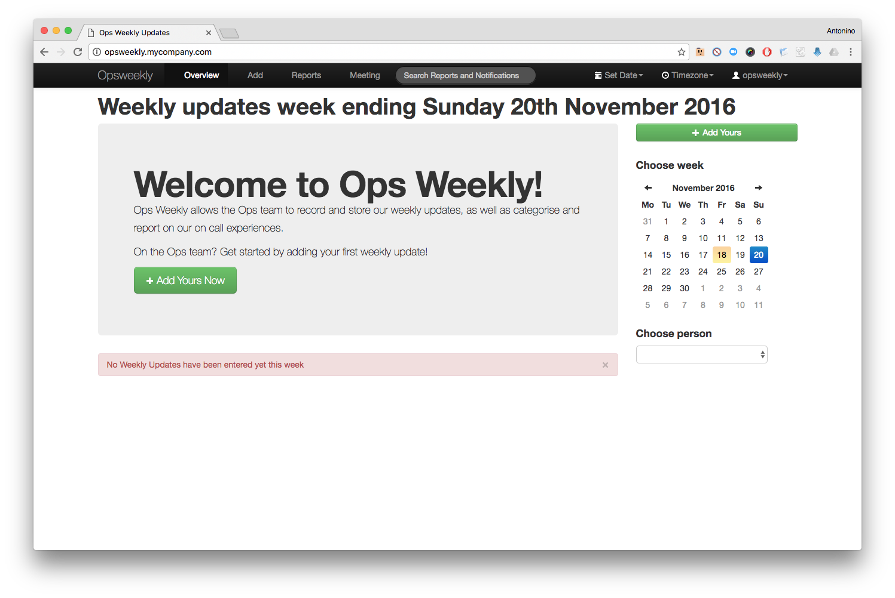
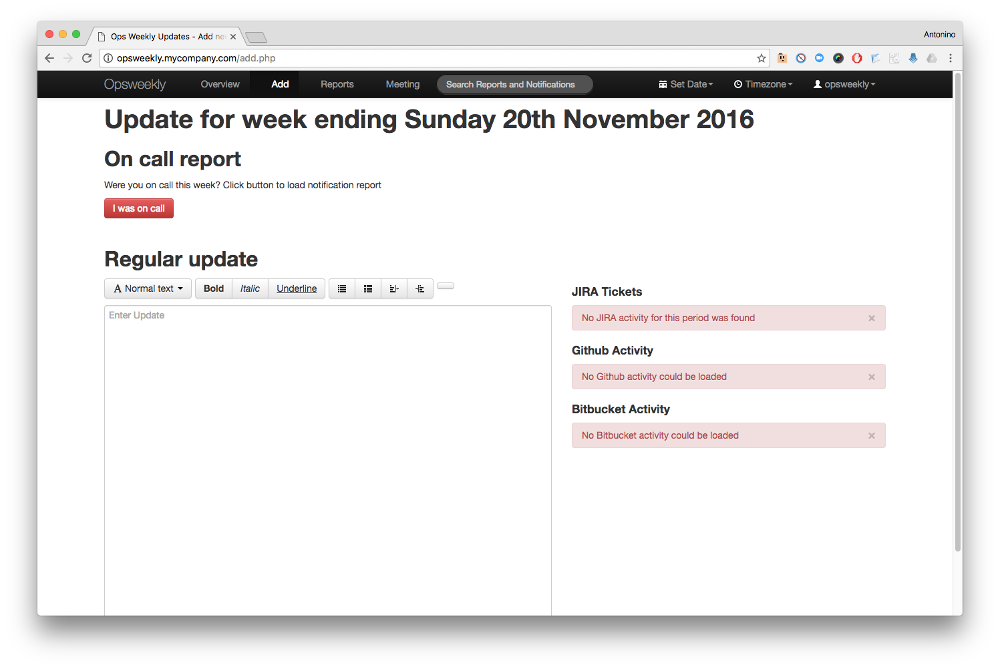

#   Opsweekly

This application is a weekly report tracker, an on call categorisation and reporting tool, a sleep tracker, a meeting organiser and a coffee maker all in one.

The goal of Opsweekly is to both organise our team into one central place, but also help us understand and improve our on call rotations through the use of a simple on call "survey", and reporting as a result of that tracking.

Opsweekly can retrieve information from Jira, GitHub, Bitbucket, Pagerduty and so on.

Opsweekly consists of two containers: one mariadb database and the application container (Apache + PHP 5).

The Opsweekly container is built from scratch starting from Alpine Linux and Opsweekly source code (https://github.com/etsy/opsweekly).





## More info
### Please visit <https://github.com/etsy/opsweekly/blob/master/screenshots/README.md> for a guided tour of how Opsweekly works and the reports it can generate!

## Requirements
- docker

## Setup
First, set these environment variables for the application:
```
DB_HOST: <NOT_A_REAL_HOST>
DB_PASSWORD: <NOT_A_REAL_PASSWORD>
DB_USER: <NOT_A_REAL_USER>
EMAIL_DOMAIN_ROOT: <NOT_A_REAL_EMAIL_DOMAIN_ROOT>
HOSTNAME: <NOT_A_REAL_HOSTNAME>
```

Second, setup the .htpasswd file and change the credentials to what you want:
```
cp config/apache2/htpasswd.example config/apache/htpasswd
```

Third, change the following configuration areas in `config.php` file (more information can be found [here](https://github.com/etsy/opsweekly)):
```
$weekly_providers
$oncall_providers
$sleep_providers
```

## Building
To build the image, run this command
```
./build.sh push
```

Once done, login to opsweekly using the credentials `opsweekly:Opsw33kly!`
